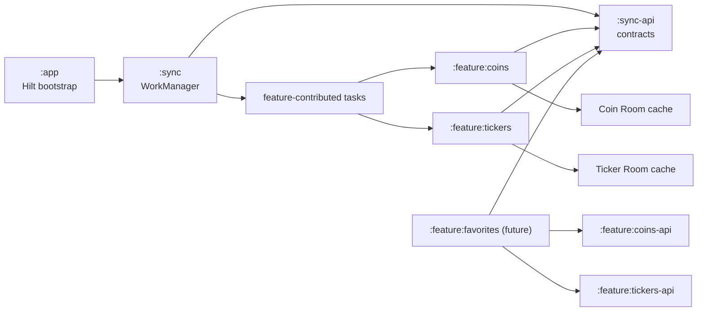

# Reusable synchronization with WorkManager

## Status

The architecture for persistent Coin and Ticker synchronization, as well as the future Favorites feature, is implemented. Because no `SyncTargetProvider` exists yet, reconciliation keeps no periodic work; Favorites will activate it by contributing tracked IDs.

## Documentation findings

- `GET /coins/{coin_id}` returns metadata without price or volume and reports an update frequency of 1 minute.
- `GET /tickers/{coin_id}` returns prices, accepts up to three quotes, and includes `last_updated`. Free-plan data updates every 5 minutes on average; paid-plan data updates every 60 seconds.
- `PeriodicWorkRequest` has a minimum interval of 15 minutes. This is a minimum separation, not an exact schedule, and constraints, Doze, and system optimizations may delay execution.
- Periodic work must be unique per key and updated with `ExistingPeriodicWorkPolicy.UPDATE`, avoiding duplicate jobs or unnecessary schedule resets.

Official sources:

- [CoinPaprika: Get coin by ID](https://docs.coinpaprika.com/api-reference/coins/get-coin-by-id)
- [CoinPaprika: Get ticker for a specific coin](https://docs.coinpaprika.com/api-reference/tickers/get-ticker-for-a-specific-coin)
- [Android: WorkManager](https://developer.android.com/reference/androidx/work/WorkManager)
- [Android: define periodic work and constraints](https://developer.android.com/develop/background-work/background-tasks/persistent/getting-started/define-work)
- [Android: integrate WorkManager with Hilt](https://developer.android.com/training/dependency-injection/hilt-jetpack)

## Cadence decision

The app uses a hybrid strategy based on the current CoinPaprika Free plan:

| Resource | Foreground freshness | Background |
| --- | ---: | ---: |
| Coin | 1 minute | 15 minutes, best effort |
| Ticker | 5 minutes | 15 minutes, best effort |

The implementation does not bypass WorkManager through an infinite chain of `OneTimeWorkRequest` instances. While a screen is active, refresh methods enforce the shorter freshness period; in the background, the policy always applies `max(apiInterval, 15 minutes)`.

## Implemented architecture

### `:sync-api`

A small module without a WorkManager dependency, consumed by features. It exposes:

- `FeatureSyncTask`: a stable key, target type, desired interval, and suspending sync operation.
- `SyncTargetProvider`: supplies typed targets; Favorites will eventually contribute favorite IDs.
- `SyncResult`: success, permanent failure, or transient failure.
- `SyncScheduler`: suspends while reconciling, scheduling, updating, and cancelling work without exposing AndroidX types to features.

`FeatureSyncTask` implementations are registered through Hilt with `@IntoSet`. A new feature only depends on `:sync-api`, implements its task, and registers it; the central worker remains unchanged.

### `:sync`

An Android module that depends on `:sync-api`, `:common`, WorkManager, and Hilt Work:

- `DelegatingSyncWorker` receives a key through `inputData`, resolves the task from the Hilt set, and maps `SyncResult` to `Result.success()`, `failure()`, or `retry()`.
- `WorkManagerSyncScheduler` creates one unique `PeriodicWorkRequest` per active task, with `NetworkType.CONNECTED`, a minimum 15-minute interval, a shared tag, and exponential backoff. The same reconciliation cancels orphaned work and tasks left without targets.
- Connectivity failures, HTTP 429, and 5xx responses are transient. Other 4xx responses, including 400 and 404, are logged per target without retrying or failing the aggregate task. Unexpected processing exceptions, such as an invalid payload, produce a permanent failure. The worker limits consecutive retries to avoid request storms.
- `:app` implements `Configuration.Provider`, injects `HiltWorkerFactory`, removes the default manifest initializer, and triggers reconciliation during bootstrap. Coin, Ticker, and Favorites rules do not live in the app module.

### Features and repositories

- `:feature:coins-api` contains the contracts and entities that Favorites needs, following the boundary already used by `:feature:tickers-api`.
- Each feature owns its Room cache and mappers; generic sync knows nothing about DTOs, DAOs, or endpoints.
- Coin stores the local `fetchedAt` instant because its endpoint does not version the response. Ticker stores `fetchedAt` and the server's `last_updated`, keyed by coin and the normalized quote set.
- Repositories expose local observation and freshness-aware refresh. Remote refresh writes the cache transactionally. The UI observes the local source instead of using `WorkInfo` as a data source.
- `CoinSyncTask` and `TickerSyncTask` synchronize only IDs supplied by `SyncTargetProvider`. Until Favorites exists, the absence of targets prevents scheduling. On retry, TTL keeps successfully refreshed IDs as a local checkpoint.
- The future Favorites feature stores only selected IDs and contributes the provider. It consumes `:feature:coins-api` and `:feature:tickers-api`, never their implementations.

## Flow

1. The app reconciles unique work at startup, cancelling orphaned keys and tasks without targets.
2. WorkManager waits for connectivity and runs the worker when the system permits.
3. The worker resolves a task from its keys, and the feature reads the tracked IDs.
4. Each repository skips data that is still fresh, fetches only expired items, and updates its cache; retries repeat only IDs that remain expired.
5. Room flows automatically notify active screens.
6. Ticker detail applies its five-minute foreground policy without depending on background execution. Coin's one-minute `refreshCoin` policy is available to future detail and Favorites consumers; the current Coins screen remains on its existing remote list flow.

## Completed implementation

1. `:sync-api` exposes tasks, targets, results, and the scheduler; `:sync` encapsulates WorkManager, constraints, and Hilt.
2. `:app` uses `HiltWorkerFactory`, on-demand configuration, and idempotently reconciles tasks at startup.
3. `:feature:coins-api` contains the public boundary; `:feature:coins` owns its Room cache and registers `CoinSyncTask`.
4. `:feature:tickers` owns a Room cache per quote set, rejects older responses, and registers `TickerSyncTask`.
5. Ticker detail uses stale-while-revalidate: it emits cached data, refreshes expired data, and preserves the latest value when the network fails.
6. Coin and Ticker lists remain on their existing remote flow to limit the migration to the Favorites use case.

Versions compatible with compileSdk 36 and AGP 8.13.2:

- WorkManager `2.11.2`.
- AndroidX Hilt Work `1.3.0`; the `1.4.0` line requires compileSdk 37/AGP 9.1.
- Room `2.8.4`.

Next increment: create `:feature:favorites`, persist its selection, register a `SyncTargetProvider`, and call `SyncScheduler.scheduleAll()` from a coroutine after changes. The central worker will not need to change.

## Tests and acceptance

- Interval unit tests: 1- and 5-minute intervals are clamped to 15 minutes in the background; longer intervals are preserved.
- Instrumented worker tests: missing key/task, success, permanent failure, transient failure, and retry limit.
- WorkManager with `work-testing`: one job per key, network constraint, idempotent `UPDATE`, explicit cancellation, orphan cancellation, and removal when no targets remain.
- Room: Coin cache upsert and emission, rejection of older tickers by `last_updated`, and disposal of incompatible serialized payloads.
- Repository: fresh cache makes no network call; expired cache calls once; failure preserves the last value; 404 does not retry.
- Instrumented execution: `./gradlew :sync:connectedDebugAndroidTest` validates real flows on a device/emulator.
- Gradle validation: compile affected modules, run their unit tests, and execute `./gradlew popcornParent -PerrorReportEnabled` because `build.gradle.kts` files changed.

## Assumptions

- The API currently uses the unauthenticated Free plan; changing plans affects the freshness policy, not the worker.
- The first increment delivers infrastructure and cache without a Favorites screen or persistence.
- Background work is best effort and may exceed 15 minutes; there is no exact update guarantee.
- Only stable AndroidX library versions are used.
