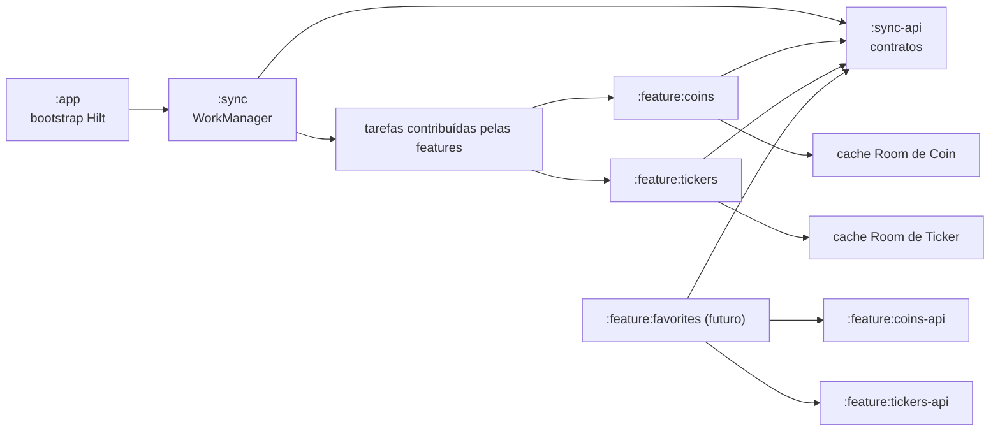

# Sincronização reutilizável com WorkManager

## Status

Arquitetura implementada para o sync persistente de Coin e Ticker e para a futura feature Favorites. Como ainda não existe um `SyncTargetProvider`, a reconciliação não mantém nenhum trabalho periódico; Favorites passará a ativá-los ao contribuir IDs rastreados.

## Evidências da documentação

- `GET /coins/{coin_id}` entrega metadados, sem preço ou volume, e informa atualização a cada 1 minuto.
- `GET /tickers/{coin_id}` entrega preços, aceita até três quotes e retorna `last_updated`. No plano Free, os dados atualizam em média a cada 5 minutos; nos planos pagos, a cada 60 segundos.
- `PeriodicWorkRequest` tem intervalo mínimo de 15 minutos. O intervalo é uma separação mínima, não um horário exato, e pode sofrer atraso por constraints, Doze e otimizações do sistema.
- Trabalho periódico deve ser único por chave e atualizado com `ExistingPeriodicWorkPolicy.UPDATE`, evitando jobs duplicados ou reinício desnecessário da agenda.

Fontes oficiais:

- [CoinPaprika: Get coin by ID](https://docs.coinpaprika.com/api-reference/coins/get-coin-by-id)
- [CoinPaprika: Get ticker for a specific coin](https://docs.coinpaprika.com/api-reference/tickers/get-ticker-for-a-specific-coin)
- [Android: WorkManager](https://developer.android.com/reference/androidx/work/WorkManager)
- [Android: definir trabalho periódico e constraints](https://developer.android.com/develop/background-work/background-tasks/persistent/getting-started/define-work)
- [Android: integrar WorkManager com Hilt](https://developer.android.com/training/dependency-injection/hilt-jetpack)

## Decisão de cadência

O app usará estratégia híbrida, considerando o plano Free atual da CoinPaprika:

| Recurso | Validade em primeiro plano | Background |
| --- | ---: | ---: |
| Coin | 1 minuto | 15 minutos, best effort |
| Ticker | 5 minutos | 15 minutos, best effort |

O WorkManager não será contornado com encadeamento infinito de `OneTimeWorkRequest`. Quando a tela estiver ativa, os métodos de refresh verificam a validade menor; em background, a política sempre aplica `max(intervaloDaAPI, 15 minutos)`.

## Arquitetura implementada

### `:sync-api`

Módulo pequeno, sem dependência de WorkManager, consumido pelas features. Expõe:

- `FeatureSyncTask`: chave estável, tipo de alvo, intervalo desejado e operação suspensa de sync.
- `SyncTargetProvider`: fornece alvos tipados; Favorites futuramente contribuirá os IDs favoritos.
- `SyncResult`: sucesso, falha permanente ou falha transitória.
- `SyncScheduler`: suspende enquanto reconcilia, agenda, atualiza e cancela tarefas sem expor tipos AndroidX às features.

As implementações de `FeatureSyncTask` são registradas por Hilt com `@IntoSet`. Uma feature nova só depende de `:sync-api`, implementa sua tarefa e a registra; não altera o worker central.

### `:sync`

Módulo Android que depende de `:sync-api`, `:common`, WorkManager e Hilt Work:

- `DelegatingSyncWorker` recebe a chave em `inputData`, resolve a tarefa no set Hilt e converte `SyncResult` em `Result.success()`, `failure()` ou `retry()`.
- `WorkManagerSyncScheduler` cria um `PeriodicWorkRequest` único por tarefa ativa, com `NetworkType.CONNECTED`, intervalo limitado a pelo menos 15 minutos, tag comum e backoff exponencial. A mesma reconciliação cancela trabalhos órfãos e tarefas que ficaram sem alvos.
- Erros de conectividade, HTTP 429 e 5xx são transitórios. Outros 4xx, incluindo 400 e 404, são registrados por alvo sem retry nem falha da tarefa agregada. Exceções inesperadas de processamento, como payload inválido, produzem falha permanente. O worker limita retries consecutivos para evitar tempestade de requests.
- O `:app` implementa `Configuration.Provider`, injeta `HiltWorkerFactory`, remove o initializer padrão do manifest e chama a reconciliação no bootstrap. Nenhuma regra de Coin, Ticker ou Favorites fica no app.

### Features e repositories

- `:feature:coins-api` contém os contratos/entidades que Favorites precisará, seguindo o boundary já usado por `:feature:tickers-api`.
- Cada feature mantém seu próprio cache Room e mapeadores; o sync genérico não conhece DTO, DAO ou endpoint.
- Coin persiste o instante local `fetchedAt`, pois o endpoint não fornece a versão da resposta. Ticker persiste `fetchedAt` e o `last_updated` do servidor, com chave composta pela moeda e pelo conjunto normalizado de quotes.
- Os repositories expõem observação local e refresh com verificação de freshness; o refresh remoto grava o cache em transação. A UI observa a fonte local e não observa `WorkInfo` como fonte de dados.
- `CoinSyncTask` e `TickerSyncTask` sincronizam somente IDs fornecidos por `SyncTargetProvider`. Até Favorites existir, a ausência de alvos impede o agendamento. Em retry, o TTL preserva os IDs já atualizados como um checkpoint local.
- A futura Favorites persiste apenas a seleção de IDs e contribui o provider; ela consome `:feature:coins-api` e `:feature:tickers-api`, nunca as implementações.

## Fluxo

1. O app reconcilia os trabalhos únicos no startup, cancelando chaves órfãs e tarefas sem alvos.
2. WorkManager aguarda conectividade e executa o worker quando o sistema permitir.
3. O worker resolve a tarefa pelas chaves e a feature consulta os IDs rastreados.
4. Cada repository descarta dados ainda válidos, busca somente itens vencidos e atualiza seu cache; retries repetem apenas os itens que permaneceram vencidos.
5. Flows do Room notificam automaticamente qualquer tela ativa.
6. O detalhe de Ticker aplica sua política de cinco minutos em foreground sem depender da execução do background. A política de um minuto de `refreshCoin` fica disponível para futuros consumidores de detalhe e Favorites; a tela atual de Coins permanece no fluxo remoto existente da lista.

## Implantação realizada

1. `:sync-api` expõe tarefas, alvos, resultados e scheduler; `:sync` encapsula WorkManager, constraints e Hilt.
2. O `:app` usa `HiltWorkerFactory`, configuração sob demanda e reconcilia as tarefas idempotentes no startup.
3. `:feature:coins-api` contém o boundary público; `:feature:coins` mantém cache Room e registra `CoinSyncTask`.
4. `:feature:tickers` mantém cache Room por conjunto de quotes, rejeita respostas antigas e registra `TickerSyncTask`.
5. O detalhe de Ticker usa stale-while-revalidate: emite cache, atualiza se vencido e preserva o último valor em falha de rede.
6. As listas de Coins e Tickers foram preservadas no fluxo remoto atual para limitar a migração ao caso de uso de Favorites.

Versões compatíveis com compileSdk 36 e AGP 8.13.2:

- WorkManager `2.11.2`.
- AndroidX Hilt Work `1.3.0`; a linha `1.4.0` exige compileSdk 37/AGP 9.1.
- Room `2.8.4`.

Próximo incremento: criar `:feature:favorites`, persistir sua seleção, registrar um `SyncTargetProvider` e chamar `SyncScheduler.scheduleAll()` em uma coroutine após alterações. Nenhuma mudança será necessária no worker central.

## Testes e aceitação

- Unitários de intervalos: 1 e 5 minutos são limitados a 15 no background; intervalos maiores são preservados.
- Instrumentados do worker: chave/tarefa ausente, sucesso, erro permanente, erro transitório e limite de retries.
- WorkManager com `work-testing`: um único job por chave, constraint de rede, `UPDATE` idempotente, cancelamento explícito, cancelamento de órfãos e remoção quando não há alvos.
- Room: upsert e emissão do cache de Coin, rejeição de Ticker mais antigo por `last_updated` e descarte de payload serializado incompatível.
- Repository: cache válido não chama rede; cache vencido chama uma vez; falha preserva o último dado; 404 não entra em retry.
- Execução instrumentada: `./gradlew :sync:connectedDebugAndroidTest` valida os fluxos reais no emulador/dispositivo.
- Validação Gradle: compilar módulos afetados, rodar seus testes unitários e executar `./gradlew popcornParent -PerrorReportEnabled` por haver alterações em `build.gradle.kts`.

## Premissas

- A API usada atualmente é o plano Free e sem autenticação; uma troca de plano altera a política de validade, não o worker.
- O primeiro incremento entrega infraestrutura e cache, sem tela ou persistência de Favorites.
- Background é best effort e pode exceder 15 minutos; não há promessa de atualização exata.
- Serão usadas apenas versões estáveis das bibliotecas AndroidX.
